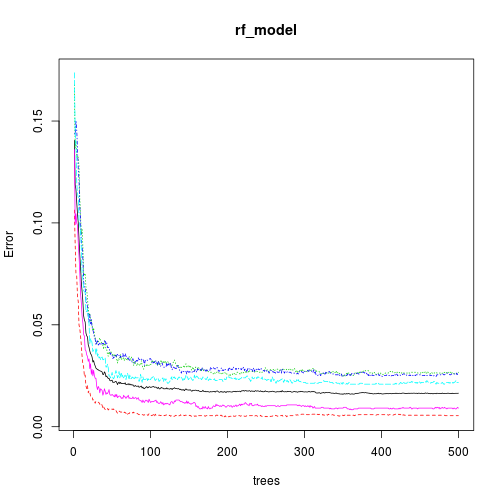

Practicle Machine Learning Writeup Assignment
========================================================

### Brief Introduction to this report.

There are devices such as *Jawbone Up, Nike FuelBand, and Fitbit* with which we can now possible to collect a large amount of data about personal activity relatively inexpensively.
In this report my goal will be to use data from accelerometers on the belt, forearm, arm, and dumbell of 6 participants and predict the manner in which 6 participants did the exercise. This report also contains how I built my model, how I used cross validation and what I think the expected out of sample error is. At the end of this report there is a prediction for 20 different test cases.

Data for this report can be found in reference section.

#### Loading required library

```r
library(RANN)
library(caret)
```

```
## Loading required package: lattice
## Loading required package: ggplot2
```


#### Loading Data(Test and Train data)

```r
pml.train <- read.csv("pml-training.csv")
pml.test <- read.csv("pml-testing.csv")
```

#### Data Prepration

splitting trainig dataset into train and test with a ratio of 7/3 of 10.


```r
set.seed(1234)
trainingIndex <- createDataPartition(pml.train$classe, list = FALSE, p = 0.7)
train = pml.train[trainingIndex, ]
test = pml.train[-trainingIndex, ]
```

Filter the numeric features and outcome. 

```r
num_idx = which(lapply(train, class) %in% c("numeric"))
```

Fixing the  missing values. This includes the imputation method using K-nearest neighbour model.


```r
preModel <- preProcess(train[, num_idx], method = c("knnImpute"))
ptraining <- cbind(train$classe, predict(preModel, train[, num_idx]))
ptesting <- cbind(test$classe, predict(preModel, test[, num_idx]))
```

Rename first Label to classe


```r
names(ptraining)[1] <- "classe"
names(ptesting)[1] <- "classe"
```


Make test set for submission


```r
prtesting <- predict(preModel, pml.test[, num_idx])
```

### Modeling with Random Forest Model


```r
library(randomForest)
```

```
## randomForest 4.6-7
## Type rfNews() to see new features/changes/bug fixes.
```

```r
rf_model <- randomForest(classe ~ ., ptraining)
plot(rf_model)
```

 

### Important Variables for above applied model
in this list variables with higher value are more important for above model


```r
varImp(rf_model)
```

```
##                          Overall
## roll_belt                 906.65
## pitch_belt                457.50
## yaw_belt                  675.07
## max_roll_belt              88.91
## min_roll_belt              91.78
## amplitude_roll_belt       117.49
## var_total_accel_belt      123.07
## avg_roll_belt              88.25
## stddev_roll_belt          113.19
## var_roll_belt             142.48
## avg_pitch_belt            108.03
## stddev_pitch_belt          67.76
## var_pitch_belt             66.21
## avg_yaw_belt               98.76
## stddev_yaw_belt           106.05
## var_yaw_belt              118.49
## gyros_belt_x               84.08
## gyros_belt_y               87.50
## gyros_belt_z              192.36
## roll_arm                  153.52
## pitch_arm                  86.70
## yaw_arm                   147.05
## var_accel_arm             129.15
## avg_roll_arm              102.43
## stddev_roll_arm            51.58
## var_roll_arm               59.09
## avg_pitch_arm              58.28
## stddev_pitch_arm           54.04
## var_pitch_arm              45.91
## avg_yaw_arm                58.03
## stddev_yaw_arm             60.70
## var_yaw_arm                59.61
## gyros_arm_x                83.00
## gyros_arm_y                94.77
## gyros_arm_z                46.88
## max_roll_arm               61.62
## max_picth_arm              60.75
## min_roll_arm              102.83
## min_pitch_arm              66.00
## amplitude_roll_arm         55.72
## amplitude_pitch_arm        59.44
## roll_dumbbell             307.93
## pitch_dumbbell            156.74
## yaw_dumbbell              195.76
## max_roll_dumbbell          85.94
## max_picth_dumbbell         81.55
## min_roll_dumbbell          89.20
## min_pitch_dumbbell         69.74
## amplitude_roll_dumbbell    53.44
## amplitude_pitch_dumbbell   62.70
## var_accel_dumbbell        140.98
## avg_roll_dumbbell         172.86
## stddev_roll_dumbbell       59.64
## var_roll_dumbbell          64.30
## avg_pitch_dumbbell         96.43
## stddev_pitch_dumbbell      54.53
## var_pitch_dumbbell         63.47
## avg_yaw_dumbbell           72.72
## stddev_yaw_dumbbell        61.74
## var_yaw_dumbbell           57.68
## gyros_dumbbell_x          107.11
## gyros_dumbbell_y          213.89
## gyros_dumbbell_z           69.37
## magnet_dumbbell_z         465.90
## roll_forearm              347.75
## pitch_forearm             309.58
## yaw_forearm               110.43
## max_roll_forearm          159.79
## max_picth_forearm          62.31
## min_roll_forearm          206.92
## min_pitch_forearm          56.97
## amplitude_roll_forearm     53.08
## amplitude_pitch_forearm    45.54
## var_accel_forearm         115.57
## avg_roll_forearm           65.05
## stddev_roll_forearm        59.33
## var_roll_forearm           67.56
## avg_pitch_forearm         174.27
## stddev_pitch_forearm       51.60
## var_pitch_forearm          47.87
## avg_yaw_forearm            78.21
## stddev_yaw_forearm         38.43
## var_yaw_forearm            45.89
## gyros_forearm_x            61.46
## gyros_forearm_y            95.59
## gyros_forearm_z            68.64
## magnet_forearm_y          131.11
## magnet_forearm_z          169.64
```


### In-sample accuracy

```r
training_pred <- predict(rf_model, ptraining)
print(confusionMatrix(training_pred, ptraining$classe))
```

```
## Confusion Matrix and Statistics
## 
##           Reference
## Prediction    A    B    C    D    E
##          A 3906    0    0    0    0
##          B    0 2658    0    0    0
##          C    0    0 2396    0    0
##          D    0    0    0 2252    0
##          E    0    0    0    0 2525
## 
## Overall Statistics
##                                 
##                Accuracy : 1     
##                  95% CI : (1, 1)
##     No Information Rate : 0.284 
##     P-Value [Acc > NIR] : <2e-16
##                                 
##                   Kappa : 1     
##  Mcnemar's Test P-Value : NA    
## 
## Statistics by Class:
## 
##                      Class: A Class: B Class: C Class: D Class: E
## Sensitivity             1.000    1.000    1.000    1.000    1.000
## Specificity             1.000    1.000    1.000    1.000    1.000
## Pos Pred Value          1.000    1.000    1.000    1.000    1.000
## Neg Pred Value          1.000    1.000    1.000    1.000    1.000
## Prevalence              0.284    0.193    0.174    0.164    0.184
## Detection Rate          0.284    0.193    0.174    0.164    0.184
## Detection Prevalence    0.284    0.193    0.174    0.164    0.184
## Balanced Accuracy       1.000    1.000    1.000    1.000    1.000
```

The in-sample accuracy is 100%.

### Out-of-sample accuracy

```r
testing_pred <- predict(rf_model, ptesting)
```


Confusion Matrix for train dataset: 

```r
print(confusionMatrix(testing_pred, ptesting$classe))
```

```
## Confusion Matrix and Statistics
## 
##           Reference
## Prediction    A    B    C    D    E
##          A 1666   11    2    2    2
##          B    5 1116   13    2    2
##          C    1   10 1000    5    7
##          D    1    0    9  952    3
##          E    1    2    2    3 1068
## 
## Overall Statistics
##                                         
##                Accuracy : 0.986         
##                  95% CI : (0.983, 0.989)
##     No Information Rate : 0.284         
##     P-Value [Acc > NIR] : <2e-16        
##                                         
##                   Kappa : 0.982         
##  Mcnemar's Test P-Value : 0.48          
## 
## Statistics by Class:
## 
##                      Class: A Class: B Class: C Class: D Class: E
## Sensitivity             0.995    0.980    0.975    0.988    0.987
## Specificity             0.996    0.995    0.995    0.997    0.998
## Pos Pred Value          0.990    0.981    0.978    0.987    0.993
## Neg Pred Value          0.998    0.995    0.995    0.998    0.997
## Prevalence              0.284    0.194    0.174    0.164    0.184
## Detection Rate          0.283    0.190    0.170    0.162    0.181
## Detection Prevalence    0.286    0.193    0.174    0.164    0.183
## Balanced Accuracy       0.996    0.988    0.985    0.992    0.993
```


The cross validation accuracy is  98.6%, which should be sufficient for predicting the 20 test observations.

### Test Set Prediction Results

Applying model to the test data.

```r
answers <- predict(rf_model, prtesting)
answers
```

```
##  1  2  3  4  5  6  7  8  9 10 11 12 13 14 15 16 17 18 19 20 
##  B  A  B  A  A  E  D  B  A  A  B  C  B  A  E  E  A  B  B  B 
## Levels: A B C D E
```


Writing outputs to 20 files.


```r
pml_write_files = function(x) {
    n = length(x)
    for (i in 1:n) {
        filename = paste0("problem_id_", i, ".txt")
        write.table(x[i], file = filename, quote = FALSE, row.names = FALSE, 
            col.names = FALSE)
    }
}
pml_write_files(answers)
```


## References
[1] http://groupware.les.inf.puc-rio.br/har#weight_lifting_exercises  
[2] https://d396qusza40orc.cloudfront.net/predmachlearn/pml-training.csv  
[3] https://d396qusza40orc.cloudfront.net/predmachlearn/pml-testing.csv
